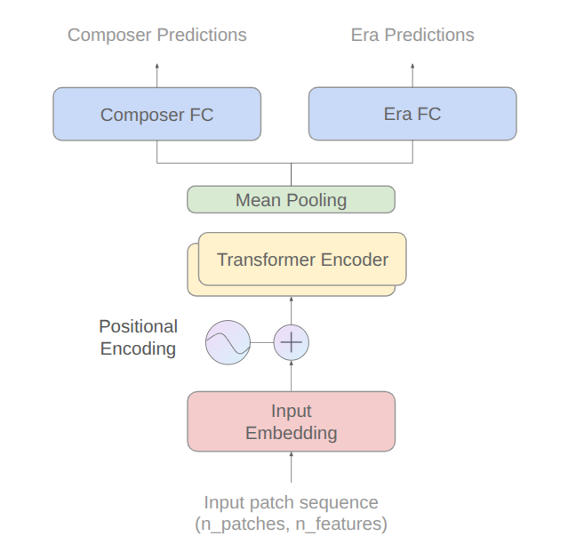

# 🎵 Team 27: Multi-Task Learning for Joint Composer and Musical Era Classification in Classical Music

> **Course Project:** Machine Learning (CSIE5043) @ National Taiwan University

This repository contains the implementation of a **Transformer-based multi-task framework** designed to jointly classify classical music composers and their corresponding musical eras from short composition snippets.

  

## 📝 Abstract

Classical music, particularly symphonies, exhibits rich harmonic, rhythmic, and structural features that capture stylistic characteristics of the composer and the time period. In this study, we propose a **multi-task learning framework** using a light-weight **Transformer model** that simultaneously classifies composers and their corresponding musical era from **Mel-patch token representations**.

By jointly learning these tasks and adding a weighting factor to the loss function, the model demonstrates that deep learning can learn meaningful stylistic patterns from relatively short music excerpts, serving as a foundation for broader MIR (Music Information Retrieval) and computational musicology research.

## 🚀 Key Results

Our Multi-Task Learning (MTL) framework outperforms the Single-Task Learning (STL) baselines on both classification tasks:

| Task | STL Accuracy (Baseline) | MTL Accuracy (Ours) |
| :--- | :--- | :--- |
| **Era Prediction** | 63.49% | **77.94%** |
| **Composer Prediction** | 68.97% | **70.87%** |

## 🧠 Model Architecture

* **Input:** Mel-patch token representations derived from audio snippets.
* **Backbone:** Light-weight Transformer.
* **Strategy:** Joint learning of Composer and Era targets using a weighted loss function to optimize for both tasks simultaneously.

## Hardware & System Requirements

- GPU: CUDA-enabled GPU with at least 4GB VRAM (required for training)
- CPU: Any modern multi-core processor
- Python: 3.10.12 (ensure dependencies are installed)

## Instructions

1. Install project dependencies: 
   'pip install -r requirements.txt' 
   or ensure all packages listed in requirements.txt are installed in your environment.

2. Prepare the Dataset - Due to copyright and storage limitations, the raw audio files are not included. Please acquire the recordings for the composers listed in our paper and organize them into the following directory structure:
Symphonies/[Era Name]/[Composer Name]/[Audio Files] (e.g., Symphonies/Baroque/Bach/track1.mp3).
   
3. Preprocessing - Convert raw audio to Log-Mel token patches and generate metadata:
   'python preprocessing.py'
   
   
Outputs: 
   processed_data.npz: The tensors used for training/inference (not included in repo due to size). 
   dataset_metadata.pkl: The class mappings and IDs. 
   

⚠️ Consistency Note: We have included our original dataset_metadata.pkl in this repository. If you are preparing your own dataset to test our pre-trained model, ensure your Symphonies/ folder structure matches ours (same Era/Composer names) so that the generated Class IDs match the weights in best_model.pth.
   
4. Training a new model using the extracted dataset:
   'python training.py data_path model_name mode'

   
Note: 
   'data_path': path containing training file (e.g., project/dataset) 
   'model_name': name of the trained model (no file extension needed) (e.g., best_model) 
   'mode': 'composer_era', 'composer', 'era' -> choose which label(s) to predict
   

   
5. For hyperparameter tuning, change the values in model_configs.py.

6. To evaluate the model and reproduce the accuracy results on the test set:
   'python inference.py data_path model_name mode'
   
   
Note: 
   'data_path': path containing test file (e.g., project/dataset) 
   'model_name': name of the trained model (no file extension needed, include path if needed) (e.g., best_model, models/best_model) 
   'mode': 'composer_era', 'composer', 'era' -> choose which label(s) to predict 
   The saved model weights are included in model/ of the repository.
   

7. To visualize embeddings from a trained model:
   'python visualization.py data_path model_name mode [data_split] [method]'
   
   
Note: 
   'data_path': path containing data file (e.g., project/dataset) 
   'model_name': name of the trained model (no file extension needed) (e.g., best_model) 
   'mode': 'composer_era', 'composer', 'era' -> must match the model's training mode 
   'data_split': (optional) 'train' or 'test' (default: 'test') 
   'method': (optional) 'umap' or 'tsne' (default: 'umap') 
   

   
   Examples:
   - 'python visualization.py project/dataset best_model composer_era test umap'
   - 'python visualization.py project/dataset best_model composer train tsne'
   
   The script will generate visualization plots in the 'visualizations/' folder:
   - Chunk-level embeddings colored by composer and era
   - Composition-level embeddings colored by composer and era
   
   
Note: For best results, ensure you've run preprocessing with the updated 
   'standardize_to_np_with_metadata' function to generate dataset_metadata.pkl

